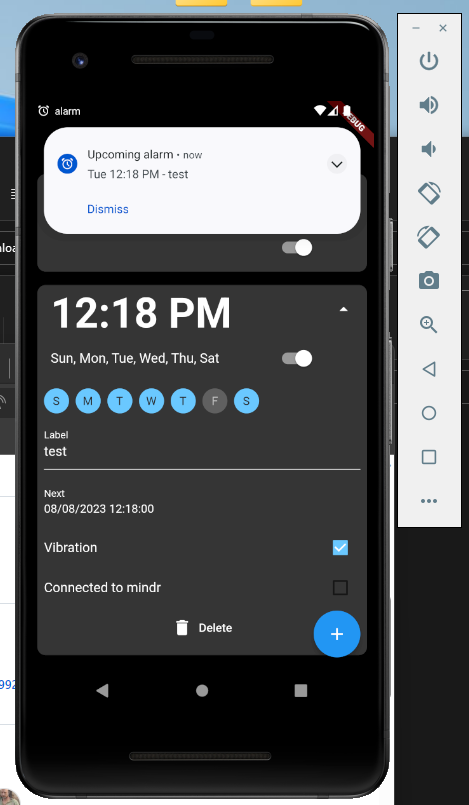
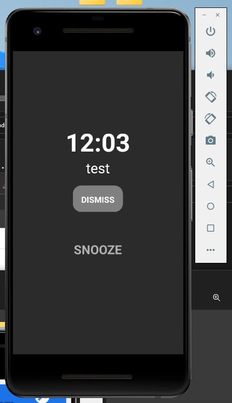
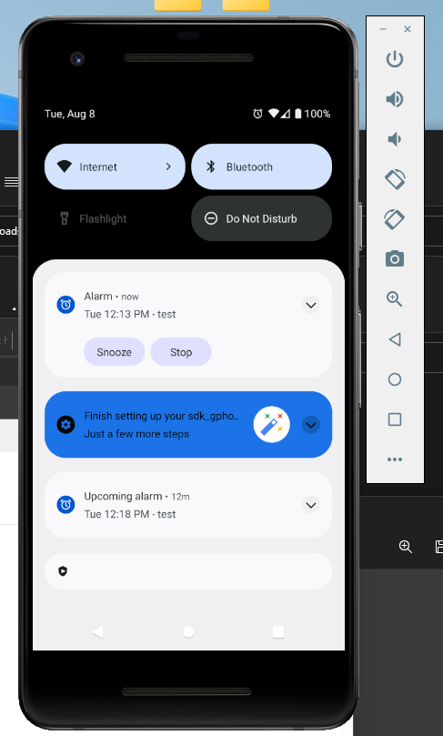
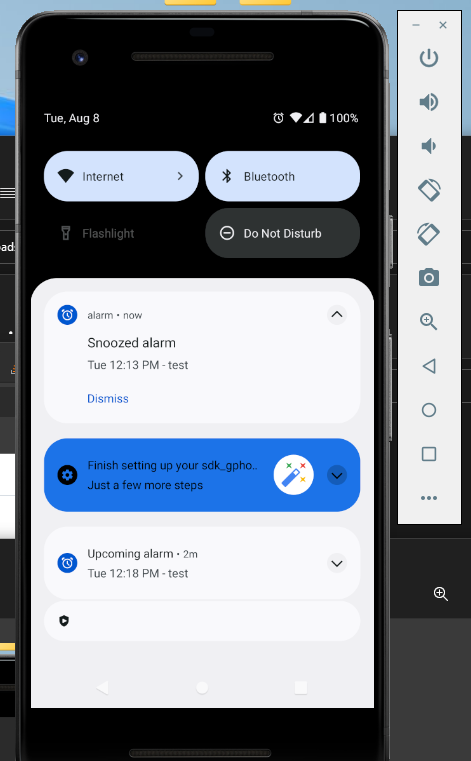

# Sample alarm app (flutter + kotlin)
An flutter sample app that can been used as alarm clock app, It can for now only been used on android devices as we build some native code,
The reason of the native code is that there where no good solution to show an full intent screen when the time has been triggered.  
(even on background or doze mode)  

## Explain Alarm.Client 
The flutter application that has the ability to set alarms.  
(PS. it is only developed for android devices.)

## Explain Alarm.Api 
This is an azure functions app that has the ability to sync your device FCM(Firebase Cloud Messaging) device token with your userID.  
With this functionality you can sync your alarm with an server where you can comunicate with your own device.  
([`here is the postman documentation`](./res/Mindr.Samples.Alarm.postman_collection.json))

## How to run
`flutter run` in ./src/Alarm.Client folder

#### Can been improved by solving following issues:
- Can't trigger FCM to the custom native code as the MethodChannel is set on the foreground and not been set on the Background in android.
- Show the full intent screen on the lock screen.
- 